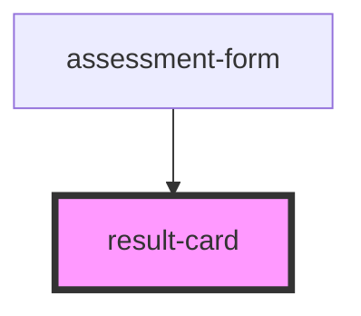

# result-card

<!-- Auto Generated Below -->

## Properties

| Property | Attribute | Description | Type                                                                                      | Default     |
| -------- | --------- | ----------- | ----------------------------------------------------------------------------------------- | ----------- |
| `result` | --        |             | `{ imageUrl: string; title: string; author: string; type: string; description: string; }` | `undefined` |

## Dependencies

### Used by

 - [assessment-form](../..)

### Graph

----------------------------------------------

*Built with [StencilJS](https://stenciljs.com/)*
